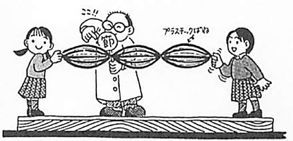
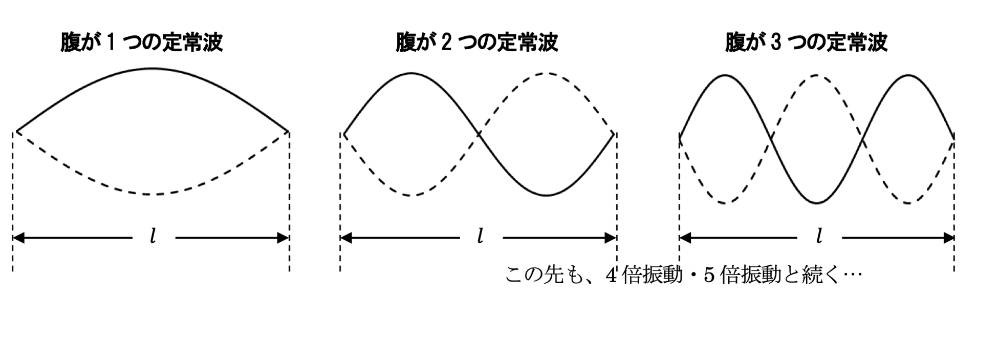
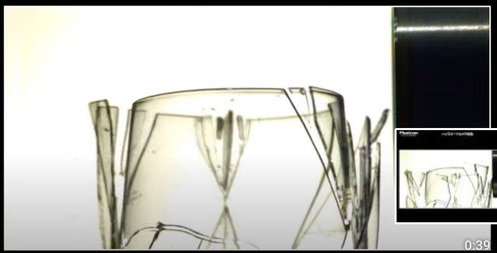
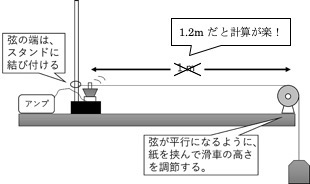

# 波
2020年度　物理基礎　長倉クラス  
12月~　  
  

[授業資料はこちら](https://github.com/phys-ken/2020buturikiso_slides)

---

### この単元の目的
* 静止画から、現象をイメージできるようになろう！  
  * 今までは、運動している物体だけに注目すれば良かったが、波の単元では、動き全体に注目する必要がある。幅広い視野が必要。  
* 目に見えない波を想像する。
  * 音や光なども波だが、本当か？

---

### No.7 定常波と共振

---

  ### プラスチックバネを振ろう！
　  
頌栄女子学院中学高等学校 北原先生 作図

---

  ### 実験結果
   　

---

### 重ね合わせと共振
[シミュレーションサイト](https://phys-ken.github.io/Resonance_Mov/export/index.html#/9)

---

### 共振と共鳴
* ある特定のリズムで揺らしたときに大きく揺れる現象を、共振（音の場合は共鳴）と呼ぶ。
  * [グラスの共振](https://www.youtube.com/watch?v=LQdHOtxsX0g&feature=emb_logo)
  * [タコマナローズ橋の崩壊](https://www.youtube.com/watch?v=3mt6KpWvpbM)

   　
　

---

### No.8 弦の振動実験

---

### 前回やったこと
* 入射波と反射波が重なり合うと、定常波ができる。
* 実際にやってみると、ちょうど良い振動数のときにしか定常波はできない。
  * 手元でも波は反射しているので、２つ以上の波が重なっている！
  * 行って戻って行って戻って…の全てがちょうどよく重なるとき、定常波は大きくなる。

--

  ### 参考　定常波

   　

--

### 前回やったこと(続き)
* ある特定のリズムで揺らしたときに大きく揺れる現象を、共振（音の場合は共鳴）と呼ぶ。
  * [グラスの共振](https://www.youtube.com/watch?v=LQdHOtxsX0g&feature=emb_logo)
  * [タコマナローズ橋の崩壊](https://www.youtube.com/watch?v=3mt6KpWvpbM)

   　

---

### 今日やること
弦の共振条件を探る！

---

### 使うもの
* スピーカー
* アンプ(長倉の手作り)  
→壊れやすいから引っ張らないで...
* iPhone
* Function Genelator アプリ

---

### 実験の状況の説明

<iframe width="560" height="315" src="https://www.youtube.com/embed/YAzylCur1O4" frameborder="0" allow="accelerometer; autoplay; clipboard-write; encrypted-media; gyroscope; picture-in-picture" allowfullscreen></iframe>

--- 
実験道具は、全てセットアップ済み

--

### 参考　実験の様子

   　

---

### 実験についてアドバイス

* スピーカーと糸は、軽く触れるように。
* まず、ピンクの弦から実験すること。
* 初めは、36~42Hzくらいで、２倍振動をみてみよう。
* +- 1Hz で微調整
* 表を埋めるのは、次回。まずは実験結果をまとめる！

---

### No.9 弦の共振(音もやりたい)

---

 ### 思い出そう。
　  
頌栄女子学院中学高等学校 北原先生 作図

---

### スピーカーと火

<iframe width="560" height="315" src="https://www.youtube.com/embed/DkdYGCfrQTE" frameborder="0" allow="accelerometer; autoplay; clipboard-write; encrypted-media; gyroscope; picture-in-picture" allowfullscreen></iframe>

---

### 横波と縦波
<video src = "fig/tateyoko.mp4" width = 400></video>